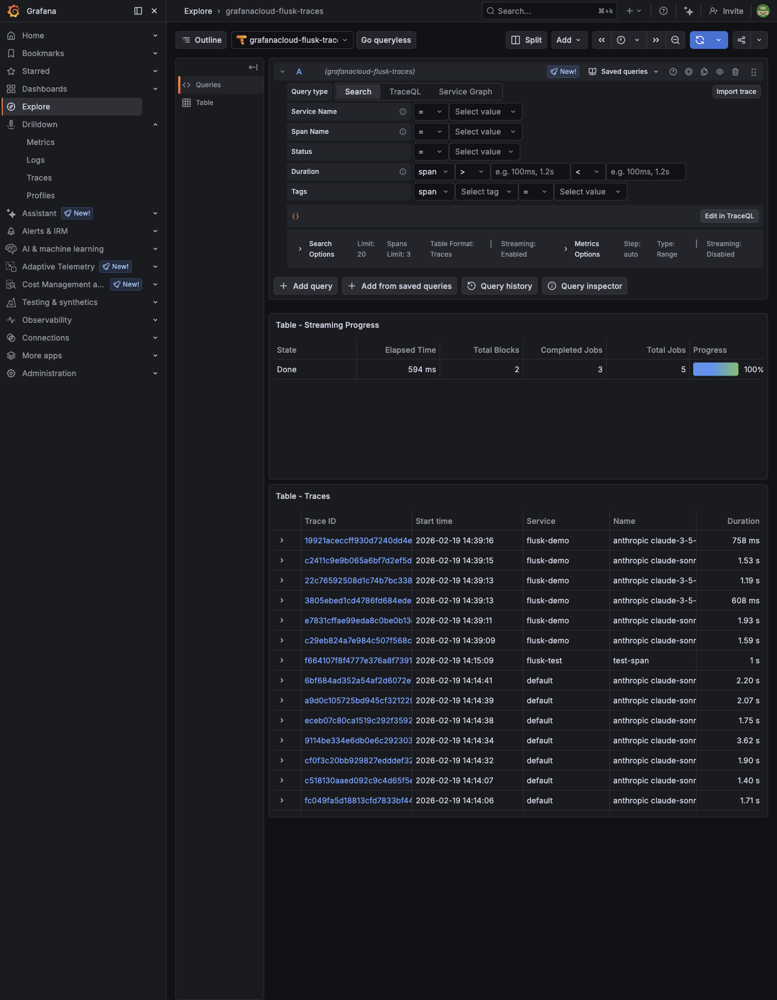
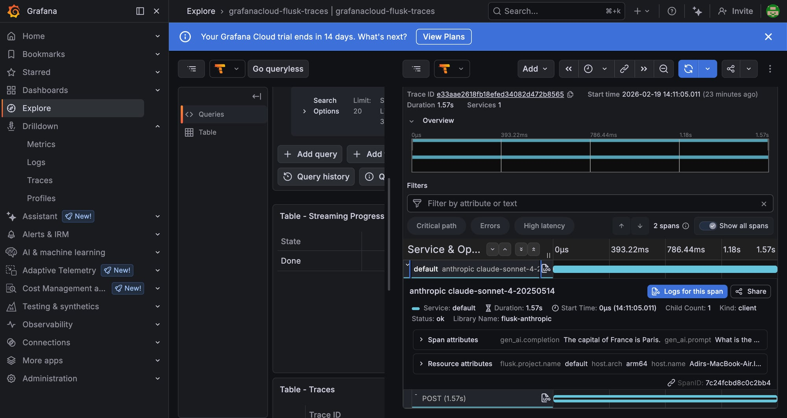

# Flusk E2E Demo

Real LLM cost tracking with **zero code changes** — just add `--import @flusk/otel`.

## Quick Start

```bash
# 1. Install
npm install @flusk/cli @flusk/otel

# 2. Write your app (examples/demo-e2e.js)
import Anthropic from '@anthropic-ai/sdk';
const client = new Anthropic();

await client.messages.create({
  model: 'claude-sonnet-4-20250514',
  max_tokens: 60,
  messages: [{ role: 'user', content: 'What is the capital of France?' }],
});

# 3. Analyze
npx flusk analyze examples/demo-e2e.js
```

## CLI Report

Running `flusk analyze` on 6 real Anthropic API calls (3× Sonnet 4, 3× Haiku 3.5):

```
┌──┬──┐
│  │  │  flusk
│  ├──┘  v0.1.0
│  │
└──┘

🔍 Analyzing examples/demo-e2e.js...

[1/6] sonnet-4: "What is the capital of France? One sentence."
  → The capital of France is Paris.
  tokens: 17in/10out

[2/6] sonnet-4: "Explain quantum computing in one sentence."
  → Quantum computing harnesses quantum mechanical phenomena...
  tokens: 15in/41out

[3/6] haiku-3.5: "What is 2+2? Just the number."
  → 4
  tokens: 18in/5out

[4/6] haiku-3.5: "Write a haiku about AI costs."
  → Circuits burning bright / Compute power...
  tokens: 15in/28out

[5/6] sonnet-4: "What is the capital of France? One sentence."  ← duplicate!
  → The capital of France is Paris.
  tokens: 17in/10out

[6/6] haiku-3.5: "Translate 'hello world' to French."
  → Bonjour monde
  tokens: 20in/8out

# Flusk Analysis Report

## Cost Summary
| Model                       | Calls | Tokens | Cost    |
|-----------------------------|-------|--------|---------|
| claude-sonnet-4-20250514    | 3     | 110    | $0.0011 |
| claude-3-5-haiku-20241022   | 3     | 94     | $0.0003 |
| **Total**                   | **6** | **204**| **$0.0013** |

## Top Expensive Calls
1. `claude-sonnet-4-20250514` — "Explain quantum computing..." — $0.0007
2. `claude-sonnet-4-20250514` — "What is the capital of France?" — $0.0002
3. `claude-sonnet-4-20250514` — "What is the capital of France?" — $0.0002

## Duplicate Prompts Detected
⚠️  "What is the capital of France?" sent 2 times → save $0.0002

## Total Potential Savings: $0.0002/run (15.2%)
```

## Grafana Cloud Integration

Add environment variables to export traces to Grafana Cloud simultaneously:

```bash
FLUSK_EXPORT=grafana \
FLUSK_GRAFANA_ENDPOINT=https://otlp-gateway-prod-us-east-0.grafana.net/otlp \
FLUSK_GRAFANA_INSTANCE_ID=<your-instance-id> \
FLUSK_GRAFANA_API_KEY=glc_... \
npx flusk analyze your-app.js
```

### Traces in Grafana Tempo

All LLM calls appear as traces with service name, model, and duration:



### Trace Detail with GenAI Attributes

Each trace includes OpenTelemetry GenAI semantic attributes:

- `gen_ai.system` — provider (anthropic, openai, etc.)
- `gen_ai.request.model` — model name
- `gen_ai.prompt` — input prompt text
- `gen_ai.completion` — output completion text
- `gen_ai.usage.input_tokens` / `gen_ai.usage.output_tokens` — token counts



## How It Works

1. **Zero-touch instrumentation** — `@flusk/otel` patches LLM SDKs (Anthropic, OpenAI, Google, Cohere, Azure, Bedrock) at import time
2. **Cost calculation** — Built-in pricing tables for all major models
3. **Duplicate detection** — SHA-256 hashes prompts to find repeated calls
4. **Multi-exporter** — SQLite (local, always) + any OTLP backend (Grafana, Datadog, New Relic)
5. **CLI report** — Instant cost breakdown, sorted by expense

## Supported Providers

| Provider | Auto-instrumented | Pricing |
|----------|------------------|---------|
| Anthropic (Claude) | ✅ | ✅ |
| OpenAI (GPT, o-series) | ✅ | ✅ |
| Google (Gemini) | ✅ | ✅ |
| Cohere (Command) | ✅ | ✅ |
| Azure OpenAI | ✅ | ✅ |
| AWS Bedrock | ✅ | ✅ |
